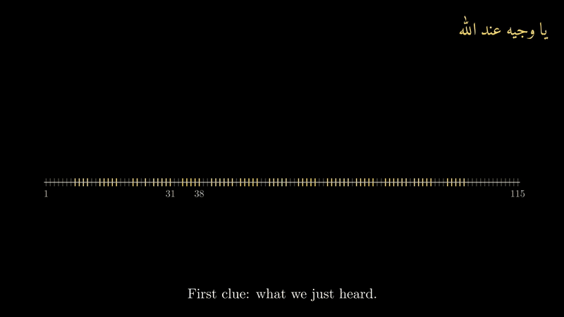

# dua-recognition

Listen to someone recite a du'a, work out **which du'a it is**, and follow along
**line by line and word by word** in real time, with the Arabic, transliteration and
translation scrolling in sync.


It knows **506 du'as and ziyarat**. On reciters it was never trained or tuned on, it
shows **the right line 85% of the time** (96% within one line), gets **88% of refrain
lines** right (a line that recurs word for word, so text alone can't place it), and
shows the wrong du'a 0.5% of the time. From a cold start mid-recitation it names the
du'a within 5 s 88% of the time and within 10 s 92%. Those numbers are for a fine-tuned
whisper-base (74 M parameters) small enough to run **in a phone's browser, on-device**;
it also hears everyday voices well enough to follow someone reading along (30%
character errors on crowd-sourced recitations, from 39% for the previous model).
v0.1 of this repo managed 43% / 6% on the same test.

One phone can also follow for a whole room: **majlis mode** relays the position to any
number of phones or a projector through a QR code.

## Why this is harder than it looks

- **Refrains.** Du'as repeat themselves. In Dua Tawassul, 70 of 115 lines are
  refrains: *"yā wajīhan ʿinda-llāh, ishfaʿ lanā ʿinda-llāh"* comes back after every one of
  the 14 names. A transcript of "the current window" matches all 14 repetitions
  equally well, so matching text alone can't say which one you're on.
- **Shared openings.** Nearly every du'a opens with *bismillāh* and a *ṣalawāt*, and
  several share whole phrases (Dua Baha and Dua Tawassul both have a line starting
  *"allāhumma innī asʾaluka…"*). Committing too early means showing the wrong du'a.
- **Melodic recitation.** A single line can be drawn out for 15 seconds, so a 6-second
  window often holds half a line or less. Off-the-shelf small Whisper models barely
  transcribe it.
- **Real time, and stopping.** The display has to move when the reciter moves, on
  hardware people actually have, and stay put when they stop: the last 6 s of audio
  still hold their last words for seconds after they fall silent.

## How it works



*The heart of a 4½-minute explainer that starts from what a du'a follower is for
([full video](docs/explainer.mp4), [source](docs/anim/explainer.py), made with
[Manim](https://www.manim.community/)). Every curve is the real tracker at one second of a
held-out recording.*

```
mic ─▶ 6 s window every 1 s ─▶ Whisper ─▶ align against every du'a ─▶ HMM follower ─▶ du'a · line · word
                                  │         (semi-global edit        (position prior
                                  │          distance, vectorized)    resolves refrains)
                                  └─ fine-tuned whisper-base: CPU / in-browser
```

**1. Transcribe.** Each hop transcribes the last 6 s (faster-whisper / CTranslate2,
batched offline, batch-of-one live). Whisper's usual silence hallucinations
(*"ترجمة نانسي قنقر"*, *"شكرا"*) and decoding loops are filtered out.

**2. Align against the whole corpus at once** ([`align.py`](src/dua_recognition/align.py)).
All 506 texts become one normalized letter string (tashkeel stripped, alef/ya/ta-marbuta
and Urdu-style variants folded, spaces dropped so Whisper's word splitting doesn't
matter). For the window's transcript *h*, a semi-global edit-distance DP gives, for
**every** word in the corpus, the cost of *h* ending exactly there. It runs as Myers'
bit-parallel algorithm (each DP column held as one bit per letter of *h*, blocked for
long fragments): one pass over the 136,527-word corpus takes ~3 ms in Python (numba)
and ~11 ms in the browser, with exactly the DP's numbers.

**3. Follow with an HMM** ([`tracker.py`](src/dua_recognition/tracker.py)). This is
*score following*, the technique used to turn sheet-music pages in time with a
performance, applied to recitation. The hidden state is the word being recited,
across all du'as.

- *Predict:* the reciter moved forward a few words since the last hop, may have
  gone back a few (reciters repeat lines), and with a small
  "teleport" probability jumped anywhere, so it recovers if someone skips ahead or
  switches du'a.
- *Pauses:* each window also reports how long the reciter has been silent (a voice
  detector, or loudness over the window's floor, which catches the long melodic notes
  voice detectors miss). The belief moves only for time they were making sound, and the
  display doesn't run on into the next line while they're silent. After a second of
  silence it steps back if it already had. Majlis mode, for a professional who breathes
  between lines, keeps running on ([pauses.md](docs/results/pauses.md)).
- *Speed and tempo:* how far is "a few words" is learned from the human timings
  (a Poisson mixture over the train reciters' speeds), and the tracker keeps a weight
  per speed that adapts to the reciter in front of it: a slow, melodic reciter and a
  brisk one get different predictions. The first version assumed about twice the real
  speed and ran a line ahead on long lines; fixing that was worth +4 points
  ([speed_prior.md](docs/results/speed_prior.md)).
- *Correct:* weight each word by `exp(-κ · cost)` from step 2.
- *Prior:* 30% on the opening words of each du'a and 70% anywhere, uniform over
  du'as. A uniform prior over *words* would make long Kumayl ten times likelier than
  short Faraj before a word is heard.

A refrain matches all its repetitions equally well, and the predicted position is what
separates them. Identification comes for free: the posterior mass inside a du'a is the
probability that it's the one being recited, and nothing is shown until one du'a holds
70% of it. Until then, the likeliest du'as are offered as "Is it…?" chips.

**4. Make it run on a CPU** ([`finetune_whisper.py`](scripts/finetune_whisper.py)).
large-v3-turbo is accurate but needs ~3.3 s per window on CPU. Small models are fast
enough but barely understand recitation out of the box (stock whisper-small: 88% window
CER). So a small model is fine-tuned on train-reciter windows with **reference-snapped
labels**:
turbo transcribes each window, the human line timings bound where in the text it can
be, and the label becomes the *reference* text the transcript aligns to. The teacher
only decides where a window starts and ends in the text, so its spelling mistakes
never reach the labels. Windows come from DuaPlayer's train reciters, YouTube, and
duas.org recordings (the last two labelled by an offline forward-backward smoother),
128 h in all; a speaker-embedding check keeps every test reciter's voice out, and
caught one test recording re-uploaded to YouTube under another name. Audio is
augmented with level changes and noise, speed and vocal-tract-length perturbation and
SpecAugment, and half the windows get synthetic room reverb and noise. The best
starting point was [tarteel-ai/whisper-base-ar-quran](https://huggingface.co/tarteel-ai/whisper-base-ar-quran)
(already trained on Quran recitation), and the result runs in the browser via ONNX
([`web/`](web/)).

The voices matter as much as the model. Professional reciters were the only test set
until a tester's own recitation fell apart, so ordinary voices are now scored too,
on 409 verified clips from [RetaSy](https://huggingface.co/datasets/RetaSy/quranic_audio_dataset)'s
crowd-sourced recitations ([`voice_eval.py`](scripts/voice_eval.py)):

| model | character errors, everyday voices |
|---|---|
| large-v3-turbo, fine-tuned (server) | 15.4% |
| large-v3-turbo, stock | 22.8% |
| whisper-small, fine-tuned | 27.2% |
| **whisper-base, fine-tuned (phone)** | **29.9%** |
| whisper-base, previous fine-tune (fewer voices, no speed/VTLP/SpecAugment) | 38.7% |

## Evaluation

Ground truth comes from [DuaPlayer](https://www.duaplayer.org), where reciters upload
recordings together with a hand-recorded start time for every line. That gives
**39 recordings (10 h) of 22 du'as and ziyarat by 12 reciters**, each second labelled
with the line being recited. The tracker searches all 506 texts (DuaPlayer's 91, plus
415 from duas.pro and duas.org), so the 484 without test recordings act as distractors.

Everything below is measured on **held-out reciters** (6 reciters, 16 recordings, 4 h): nobody in
the test set was used to tune the tracker or to train an ASR model. The split is by
reciter, not by recording ([`splits.py`](src/dua_recognition/splits.py)). The
evaluation replays each recording exactly as the live system hears it (6 s windows,
1 s hop) and compares the displayed line with the true line once per second.

| front end | line | ±1 line | refrain lines | wrong du'a shown | median lag | du'a found @3 s | @10 s |
|---|---|---|---|---|---|---|---|
| v0.1: per-window matcher (turbo) | 42.7% | 71.4% | 5.8% | 12.9% | 3.6 s | 66% | 88% |
| large-v3-turbo, stock | 81.5% | 96.1% | 82.6% | 0.4% | 1.4 s | 62% | 91% |
| large-v3-turbo + prompt biasing | 84.8% | 96.2% | 88.1% | 0.4% | 1.2 s | 70% | 93% |
| large-v3-turbo, fine-tuned (server) | 84.0% | 96.3% | 88.7% | 0.4% | 1.3 s | 76% | 92% |
| whisper-small, fine-tuned | 84.4% | 96.3% | 88.4% | 0.3% | 1.3 s | 76% | 92% |
| whisper-base (Quran), fine-tuned, previous | 85.2% | 96.2% | 89.1% | 0.3% | 1.2 s | 75% | 92% |
| **whisper-base (Quran), fine-tuned on more voices (phone)** | **84.8%** | **96.2%** | **87.8%** | 0.5% | 1.3 s | 72% | 92% |

The fine-tunes all follow professional reciters about equally well; where they differ is
everyday voices (the table in step 4), which is why the phone runs the last one. With
91 texts the du'a was found within 3 s about 89% of the time; 5.5 times as many
candidates, many sharing whole phrases, slow that first guess, while the wrong-du'a rate
fell. The front-end comparison ([comparison.md](docs/results/comparison.md)) and
`test_small-ft.md` (the first whisper-small fine-tune) are from the 91-text corpus.

Ziyarat Ashura is excluded from line accuracy (its human timings drift by several
lines) but kept for identification. On the 91-text corpus, a simulated phone-in-a-room (reverb, 15 dB SNR)
costs the clean-trained model 8.5 points (85.4% to 76.9%); training with room
augmentation wins almost all of that back, 84.9% in the room
([comparison.md](docs/results/comparison.md)).

Full tables and per-du'a breakdowns are in [docs/results/](docs/results/): one file
per ASR front end, plus the ASR benchmark, the front-end comparison, and
[speed_prior.md](docs/results/speed_prior.md) (the error analysis behind the speed and
tempo model, and a negative result on scoring text straight from CTC posteriors), and
[display_lead.md](docs/results/display_lead.md) (keeping the live display on the word
being said: predicting past the ASR delay and gliding the highlight, scored against
forced-aligned word timings), [pauses.md](docs/results/pauses.md) (waiting when the
reciter stops, on a benchmark with pauses inserted into the test recordings) and
[unknown_dua.md](docs/results/unknown_dua.md) (saying "I don't know this one" for a
du'a that isn't in the corpus).

## Run it

```bash
pip install -e ".[web,eval,dev]"
python scripts/fetch_duaplayer.py        # translations, timings, audio -> data/duaplayer/ (~210 MB)
pytest

python app/server.py                     # http://localhost:8000: recite, or replay a recording
python app/demo.py recitation.mp3        # terminal version (no argument = microphone)
```

Pick the ASR model with `DUA_ASR_MODEL` (default `large-v3-turbo`; it runs on GPU when
one is available). On a CPU-only machine, or for the in-browser version, use the
fine-tuned base model:

```bash
python scripts/transcribe_windows.py                      # teacher transcripts of every window
python scripts/build_finetune_set.py --youtube --untimed --version v4   # reference-snapped labels (train voices)
python scripts/finetune_whisper.py --base tarteel-ai/whisper-base-ar-quran --name whisper-base-aug-v4     --data v4 --room 0.5 --epochs 3 --speed 0.5 --vtlp 0.5 --specaug
DUA_ASR_MODEL=models/whisper-base-aug-v4-ct2 DUA_ASR_DEVICE=cpu python app/server.py

# on-device: no server, nothing leaves the phone
python scripts/export_web.py                              # web/corpus.json
python scripts/export_onnx.py models/whisper-base-aug-v4   # web/models/ (see its docstring)
python -m http.server -d web                              # any static host works
```

**Majlis mode:** with `app/server.py` running, tap *Aa → Show on other screens* while
following. Other phones or a projector scan the QR code (or open `?watch=CODE`) and
follow along. They run no speech recognition themselves.

Reproduce the numbers:

```bash
python scripts/transcribe_windows.py --model large-v3-turbo
python scripts/evaluate.py                                # test reciters
python scripts/evaluate.py --split train --tune           # tracker grid search (train only)
```

## Layout

```
src/dua_recognition/
  text.py        Arabic normalization (tashkeel, alef/ya/ta-marbuta, alef wasla, Persian letters)
  corpus.py      du'a texts; labelled recordings
  align.py       corpus index + semi-global alignment (bit-parallel Myers, numba)
  tracker.py     the HMM follower (speed prior + tempo adaptation, pauses, "not a known du'a")
  display.py     the gliding word highlight between updates
  ctc_align.py   scoring text straight from CTC posteriors (experimental; see speed_prior.md)
  offline.py     forward-backward smoother: labels untimed audio (YouTube training data)
  asr.py         batched faster-whisper decoding, hallucination filters, silence timing
  pipeline.py    StreamingRecognizer: audio chunks in, positions out
  splits.py      reciter-disjoint train/test split
  classify.py, match.py   v0.1 baselines (per-window matching), kept for comparison
scripts/         data: fetch_duaplayer, fetch_duaspro, fetch_duasorg, fetch_youtube, find_captioned, speaker_check
                 training: transcribe_windows, align_offline, build_finetune_set, finetune_whisper, export_onnx
                 evaluation: evaluate, word_truth, word_eval, pause_eval, ooc_eval, voice_eval, asr_benchmark, ...
                 noha research: noha_lid, noha_match, noha_finetune, ...
app/             server.py (FastAPI + WebSocket; majlis-mode rooms); demo.py (CLI)
web/             the one front end: server or on-device engine (transformers.js + tracker.js port)
data/duas/       506 Arabic reference texts, one JSON per du'a
```

## Data and licensing

The Arabic texts in `data/duas/` are the traditional texts of these supplications,
as published by [DuaPlayer](https://www.duaplayer.org) (a non-profit),
[duas.pro](https://duas.pro) and [duas.org](https://www.duas.org); each file names its
source. Translations, transliterations, line timings and audio belong to those sites and
their reciters. They aren't redistributed here: the `fetch_*.py` scripts download them
into an ignored local cache for evaluation and training. Please support them if you
find this useful.

Code is MIT-licensed.
