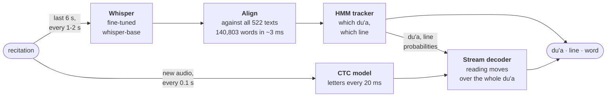

<h1 align="center">dua-recognition</h1>

<p align="center">
  <b>Recognizes which du'a is being recited and follows it line by line and word by word, live.</b><br>
  In a phone's browser, with nothing leaving the phone, or with the models on a server.
</p>

<p align="center">
  <a href="https://github.com/Hasan-Mehdi/dua-recognition/actions/workflows/tests.yml"></a>
  <a href="LICENSE"></a>
  
</p>

<p align="center">
  
  <br><sub>Dua Tawassul recited by Hussein Ghareeb (<a href="https://www.duaplayer.org">DuaPlayer</a>), a voice held out of training, through the real page at a phone's speed. Gold: the last 6 s Whisper read and what it heard; it names the du'a and keeps the follower on it. White: the tenth of a second the letter model hears at each step, inside the 3 s it remembers, and the letters it heard; they move the highlight.</sub>
</p>

<p align="center">
  <a href="#quick-start">Quick start</a> ·
  <a href="docs/how-it-works.md">How it works</a> ·
  <a href="docs/evaluation.md">Evaluation</a> ·
  <a href="docs/development.md">Development</a> ·
  <a href="docs/explainer.mp4">Explainer video</a>
</p>

## What it does

- **Names the du'a** from anywhere in a recitation: 522 du'as, ziyarat and munajat; 94% within 10 s of the first words no other text shares
- **Follows the line and the word**, with Arabic, transliteration and English side by side
- **Keeps up with real reading:** pauses, repeated lines, going back, skipping, talk or a salawat between lines
- **Practice mode:** checks a reading line by line and marks the lines left out; the text can stay hidden until you say it
- **Private:** both models run in the phone's browser, so no audio leaves the phone
- **Majlis mode:** one phone drives other phones or a projector through a QR code
- **Easy to read:** five Arabic typefaces, text size, word or line highlighting, favourites, a kids mode

## Results

The [scenario bench](docs/evaluation.md#the-scenario-bench) plays voices held out of training
through 24 ways people read (pauses, repeats, going back, talk between lines, a big hall, a
distant phone…) and scores what the page shows. Test voices, the page as of 2026-10-07, at a
phone's real pace (Whisper every 2 s and shown 1.8 s late, as on a Galaxy Z Flip 6): 617 items,
22 h, 55 voices.

| voices | on the line | on the word | du'a named ≤10 s\* | jumps per 10 min | wrong du'a shown |
|---|---:|---:|---:|---:|---:|
| studio reciters | 89% | 78% | 99% | 1.33 | 0.5% |
| du'a nights (crowd, PA echo) | 90% | 72% | 100% | 3.46 | 2.2% |
| uploaded recitations | 89% | 71% | 91% | 2.13 | 0.9% |
| Mafatih texts | 93% | 80% | 93% | 0.48 | 0.0% |
| **all** | **91%** | **76%** | **94%** | **1.49** | **0.6%** |
| server engine, all | 94% | 83% | 99% | 1.70 | 0.5% |

\* Timed from the first words no other text shares. From the start of reading it's 90% (studio 75%):
many du'as open with words other texts have too.

- **Before 2026-10-07**, at the same pace, the phone was on the line 89% of the time and on the
  word 60%, and named the du'a within 10 s\* 83% of the time. A streaming word model, cheap enough
  to run every 0.1 s on a phone, and a Whisper distilled from the server's made the difference
  ([phone_engine.md](docs/results/phone_engine.md)).
- **Read straight through:** 94% on the line, 81% on the word, 0.15 jumps per 10 minutes.
- **Weakest:** a phone far from the reader (85% on the line, named within 10 s\* 73% of the time),
  a big hall (88%), readers who jump around the du'a (76%), and du'as the app doesn't have, which
  are shown as one it does about a third of the time ([known limits](docs/evaluation.md#known-limits)).
- **In a simulated masjid** (a PA, a measured hall, people talking): 67% on the line and 57% on
  the word on the phone, 81% and 74% on the server engine.
- **Through the real page,** on the same 20 test items: a phone at its real speed 86% on the line
  and 72% on the word, the server engine 91% and 82%
  ([server_profile.md](docs/results/server_profile.md)).
- **Practice mode:** catches 91% of lines left out and every forgotten ending; marks 0.13 read
  lines per 10 minutes as left out ([practice_bench.md](docs/results/practice_bench.md)).

## Quick start

```bash
git clone https://github.com/Hasan-Mehdi/dua-recognition.git
cd dua-recognition
pip install -e ".[web]"
python scripts/fetch_duaplayer.py   # translations and sample recordings (~210 MB, kept locally)
python app/server.py                # open http://localhost:8000
```

The trained models aren't published yet. A fresh clone runs stock Whisper large-v3-turbo on the
server (downloaded on first run, on a GPU if there is one) and follows line by line, without
word-by-word following until the CTC model is trained.

| to… | do this |
|---|---|
| train the phone's two models | [the phone model](docs/development.md#the-phone-model) |
| run with no server at all | [export them to `web/models/`](docs/development.md#on-device-no-server-nothing-leaves-the-phone), then any static host |
| follow in a terminal | `python app/demo.py [recitation.mp3]` |
| mirror to other screens | while following, tap **Aa → Show on other screens** and scan the QR code |

## How it works



- **Whisper finds the du'a.** Its transcript is matched against every word of every text, and
  the tracker turns the matches and the reader's pace into a probability for each du'a and line.
  A du'a is named once it reaches 70%.
- **Letters place the word.** A small CTC model hears letters as they are said. The stream
  decoder follows them through the du'a, allowing for going back, repeating, skipping and
  stopping to talk.
- **Both run on the phone.** The models are a whisper-base cut to an 8 s context, distilled from
  the server's Whisper, and a streaming CTC student distilled from wav2vec2 that encodes only the
  new audio at each step, both trained with synthetic ordinary voices and halls. The server
  engine is the same page with larger models on a server: a fully fine-tuned large-v3-turbo and
  the student on longer, more frequent windows.

More: [how it works](docs/how-it-works.md), and the [narrated explainer](docs/explainer.mp4) (7:07).

## Documentation

| | |
|---|---|
| [How it works](docs/how-it-works.md) | alignment, the tracker, the phone models, the stream decoder |
| [Evaluation](docs/evaluation.md) | the scenario bench, the studio test, known limits |
| [Development](docs/development.md) | setup, settings, judging a change, training and export, debug sessions |
| [Research notes](docs/results/) | one write-up per experiment, negative results included |

```
src/dua_recognition/   alignment, tracker, stream decoder, word followers, practice checker
web/                   the app: everything runs in the page; the models in Web Workers or on the server
app/                   FastAPI server (page, majlis rooms, debug sessions, server engine) and terminal demo
scripts/               data, training, export, evaluation, the scenario bench
data/duas/             the 522 texts, one JSON file each
tests/                 pytest, including Python/JavaScript parity tests (need Node)
```

## Contributing

Issues and pull requests are welcome. Reports of du'as or recitation the app follows poorly help
most, ideally with a [debug session](docs/development.md#debug-sessions) attached (what the app
heard and showed). Tests: `pip install -e ".[dev]" && pytest`.

## Acknowledgements

| | |
|---|---|
| **Texts and recordings** | [DuaPlayer](https://www.duaplayer.org), a non-profit, and its reciters, whose hand-timed recordings make evaluation possible · [duas.org](https://www.duas.org) · [duas.pro](https://duas.pro) ([open API](https://github.com/duas-pro/shia-duas-api)) |
| **Models** | [Whisper](https://github.com/openai/whisper) · [tarteel-ai/whisper-base-ar-quran](https://huggingface.co/tarteel-ai/whisper-base-ar-quran), the base of the phone model · [wav2vec2-large-xlsr-53-arabic-quran](https://huggingface.co/rabah2026/wav2vec2-large-xlsr-53-arabic-quran-v_final), the base of the word aligner and the CTC teacher · [Silero VAD](https://github.com/snakers4/silero-vad) · [OmniVoice](https://huggingface.co/k2-fsa/OmniVoice), for synthetic voices and the explainer's narration |
| **Runtimes** | [faster-whisper](https://github.com/SYSTRAN/faster-whisper) and [CTranslate2](https://github.com/OpenNMT/CTranslate2) on the server · [Transformers.js](https://github.com/huggingface/transformers.js) and [ONNX Runtime Web](https://onnxruntime.ai) in the browser |
| **Evaluation** | [RetaSy's Quranic audio dataset](https://huggingface.co/datasets/RetaSy/quranic_audio_dataset), for everyday voices |
| **Design** | [Manim Community](https://www.manim.community/) for the explainer · Amiri, Aref Ruqaa, Scheherazade New, Noto and EB Garamond typefaces |

## License

Code: [MIT](LICENSE). The Arabic texts in `data/duas/` are the traditional supplications as
published by DuaPlayer, duas.pro and duas.org; each file names its source. Translations,
transliterations, timings and audio belong to those sites and their reciters and aren't
redistributed here: `scripts/fetch_*.py` downloads them into an ignored local cache. Please
support them if you find this useful.
