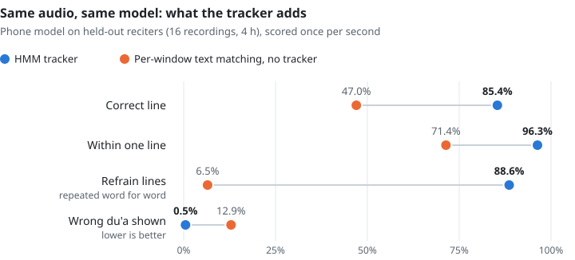
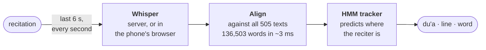

<h1 align="center">dua-recognition</h1>

<p align="center">
  <b>Recognizes which du'a is being recited and follows it line by line, live.</b><br>
  On a GPU server, or entirely on-device in a phone's browser.
</p>

<p align="center">
  <a href="https://github.com/Hasan-Mehdi/dua-recognition/actions/workflows/tests.yml"></a>
  <a href="LICENSE"></a>
  
</p>

<p align="center">
  
  <br><sub>Dua Tawassul recited by Hussein Ghareeb (<a href="https://www.duaplayer.org">DuaPlayer</a>), a voice held out of training. Beside the phone: the sound, and what Whisper heard in it each second.</sub>
</p>

<p align="center">
  <a href="#quick-start">Quick start</a> ·
  <a href="docs/how-it-works.md">How it works</a> ·
  <a href="docs/evaluation.md">Evaluation</a> ·
  <a href="docs/development.md">Development</a>
</p>

## Features

- **Names the du'a** from anywhere in a recitation, among 505 du'as and ziyarat, usually within 10 s
- **Follows line and word**, with the Arabic, transliteration and English side by side
- **Handles real recitation:** repeated refrains, shared passages, long melodic notes and pauses
- **Private on-device mode:** fine-tuned Whisper runs in the phone's browser, so no audio leaves the phone
- **Majlis mode:** one phone drives other phones or a projector through a QR code
- **Easy to read:** five Arabic typefaces, adjustable text size, word or line highlighting, favourites

## Results

Everything is measured on reciters held out of all training and tuning. Each recording is
replayed exactly as the live system hears it.

<p align="center">
  <picture>
    <source media="(prefers-color-scheme: dark)" srcset="docs/tracker-dark.svg">
    
  </picture>
</p>

| model | runs on | correct line | ±1 line | refrain lines | wrong du'a | named in 10 s |
|---|---|---:|---:|---:|---:|---:|
| **whisper-base, fine-tuned** | phone browser | **84.8%** | **96.2%** | **87.8%** | 0.5% | **92%** |
| large-v3-turbo, fine-tuned | server | 84.0% | 96.3% | 88.7% | 0.4% | 92% |
| large-v3-turbo, stock | server | 81.5% | 96.1% | 82.6% | 0.4% | 91% |

On everyday, non-professional voices, the phone model's character error rate is 29.9%
(15.4% for fine-tuned turbo). → [Full evaluation](docs/evaluation.md)

## Quick start

```bash
git clone https://github.com/Hasan-Mehdi/dua-recognition.git
cd dua-recognition
pip install -e ".[web]"
python scripts/fetch_duaplayer.py   # translations and sample recordings (~210 MB, local only)
python app/server.py                # open http://localhost:8000
```

Recite, or play a sample recording. The server downloads Whisper large-v3-turbo on first
run and uses a GPU when one is available.

| to… | do this |
|---|---|
| follow the mic or a file in a terminal | `python app/demo.py [recitation.mp3]` |
| run with no server at all | [fine-tune and export the phone model](docs/development.md#the-phone-model) |
| mirror to other screens | while following, tap **Aa → Show on other screens** and scan the QR code |

## How it works



A single window's text can't tell repeats of a refrain apart. The tracker predicts where the
reciter should be by now, the way score followers track sheet music, and that settles which
repeat it is. It adapts to the reciter's tempo and waits through pauses.

<p align="center">
  
  <br><sub>One window matches all 14 repeats of a refrain. The tracker's prediction leaves only the right one.</sub>
</p>

## Documentation

| | |
|---|---|
| [How it works](docs/how-it-works.md) | the problem, alignment, tracker and phone model |
| [Evaluation](docs/evaluation.md) | method, full results, per-du'a tables |
| [Development](docs/development.md) | setup, configuration, training and export, debug sessions, code map |
| [Research notes](docs/results/) | one write-up per experiment, negative results included |

### Repository layout

```
src/dua_recognition/   text normalization, corpus alignment, HMM tracker, streaming pipeline
app/                   FastAPI server (streaming, majlis rooms) and terminal demo
web/                   the app, with server or on-device engine (Transformers.js, ONNX Runtime Web)
scripts/               data collection, training, export, evaluation
data/duas/             505 reference texts, one JSON file per du'a
tests/                 pytest suite
```

## Contributing

Issues and pull requests are welcome. Reports of du'as or recitation styles the app follows
poorly help most, especially with a [debug session](docs/development.md#debug-sessions)
attached, which records what the app heard and showed. Run the tests with
`pip install -e ".[dev]" && pytest`.

## Acknowledgements

| | |
|---|---|
| **Texts and recordings** | [DuaPlayer](https://www.duaplayer.org), a non-profit, and its reciters, whose hand-timed recordings make evaluation possible · [duas.org](https://www.duas.org) · [duas.pro](https://duas.pro) ([open API](https://github.com/duas-pro/shia-duas-api)) |
| **Models** | [Whisper](https://github.com/openai/whisper) · [tarteel-ai/whisper-base-ar-quran](https://huggingface.co/tarteel-ai/whisper-base-ar-quran), the base of the phone model · [wav2vec2-large-xlsr-53-arabic-quran](https://huggingface.co/rabah2026/wav2vec2-large-xlsr-53-arabic-quran-v_final), the base of the word aligner · [Silero VAD](https://github.com/snakers4/silero-vad) |
| **Runtimes** | [faster-whisper](https://github.com/SYSTRAN/faster-whisper) and [CTranslate2](https://github.com/OpenNMT/CTranslate2) on the server · [Transformers.js](https://github.com/huggingface/transformers.js) and [ONNX Runtime Web](https://onnxruntime.ai) in the browser |
| **Evaluation** | [RetaSy's Quranic audio dataset](https://huggingface.co/datasets/RetaSy/quranic_audio_dataset), for everyday voices |
| **Design** | [Manim Community](https://www.manim.community/) for the explainer · Amiri, Aref Ruqaa, Scheherazade New, Noto and EB Garamond typefaces |

## License

Code: [MIT](LICENSE). The Arabic texts in `data/duas/` are the traditional supplications
as published by DuaPlayer, duas.pro and duas.org, and each file names its source.
Translations, transliterations, timings and audio belong to those sites and their reciters.
They are not redistributed here: `scripts/fetch_*.py` downloads them into an ignored local
cache. Please support them if you find this useful.
